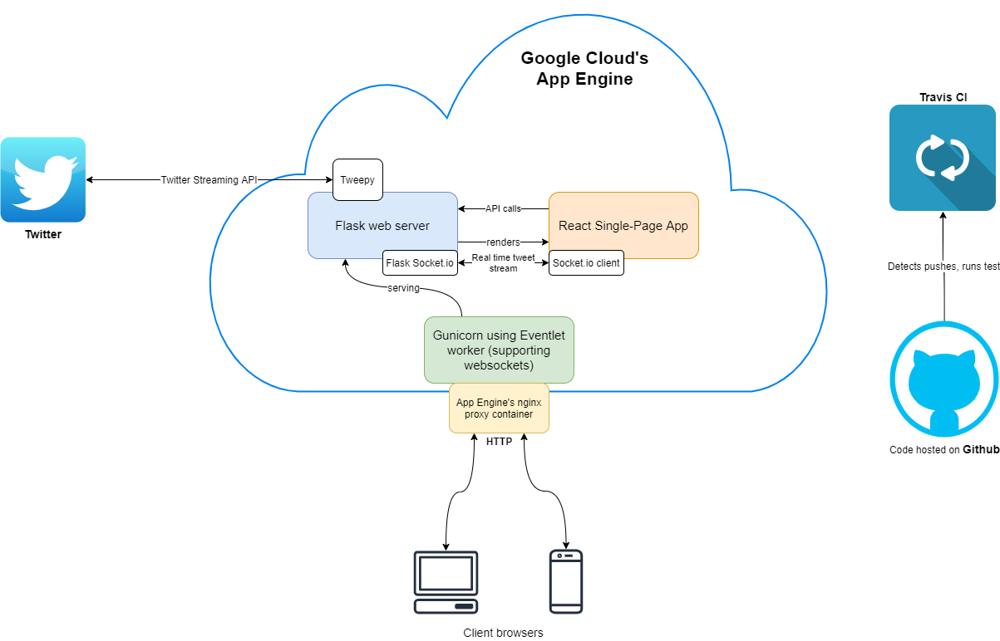

## Servian Real-time Twitter Stream Project

**Live web app link**: https://hazel-tome-269200.appspot.com/

### Requirements
A client wants to build a web-based application (and relevant infrastructure) to showcase a stream of Twitter tweets to end-users in real-time.

### Summary
The Servian real-time Twitter stream (ST) project is a web-based application built on Flask backend and a React frontend running on Google App Engine (GAE).

### Setting up the project
If you would like to run ST locally on your computer, do the following, assuming unix-like systems (note, only tested on Ubuntu):
1. Install Node.js (tested on v13.9.0)
2. Install Python 3 (tested on 3.7.1). I recommend [pyenv](https://github.com/pyenv/pyenv) with [virtualenv](https://github.com/pyenv/pyenv-virtualenv) for easy python version and environment management.
3. Clone this repo to your local machine
4. In a python virtual environment, run `pip install -r requirements` to install the python requirements.
5. `cd ui`, then run `npm install` to install all requirements (although I recommend [yarn](https://yarnpkg.com/) instead of npm)
6. Run the webpack development web server: `npm start`
7. Run the Flask web server: `cd ../;./start_server.sh` (make sure to be in the virtual environment selected in step 4)
8. ...
9. $$[Profit](http://localhost:5000/dev)$$

*Running tests:*

1. For python Flask: `cd servian_twitter;pytest`
2. For React js: `cd ui;npm test`

### Architecture Overview
The code architecture is summarized in the diagram below

- A user on their phone or computer goes to the [web application](https://hazel-tome-269200.appspot.com/) will be served a React single-page application (SPA) that is served using Flask running on [a socket.io build](https://flask-socketio.readthedocs.io/en/latest/).
- The React SPA has the socket.io client api which receives messages from the Flask server every time a new tweet comes in.
- A new tweet is detected using Twitter's streaming API via [tweepy](http://docs.tweepy.org/en/v3.4.0/streaming_how_to.html).
- Tweets are archived into an SQLite database, so that every time users first open the webapp, they will not see a blank page.
- The application code is hosted on Github, which is watched by Travis CI who tests the application.
- The system config is stored in a SQLite Database (previously in a json file). Right now the system config holds the Twitter API credentials as well as certain configuration to the presentation of tweet data to the client-side React SPA.

### Technology rationale
Building a real-time web-based application immediately called out for "[_React!!_](https://reactjs.org/docs/getting-started.html)" in my mind, although true real-time communication between client-server has not been an area I am too familiar with. There was an option of using good'ol ajax to poll the web server every few seconds, but I wanted to explore something that handles "true" real-time communication. That is where I started exploring about websockets. Thus, [_socketio_](https://flask-socketio.readthedocs.io/en/latest/) with _eventlet_ (used by [_gunicorn_](https://gunicorn.org/) in App Engine) were chosen.

#### Front-end
[_React_](https://reactjs.org/docs) was chosen as the main front-end framework due to past experience.

[_React Material UI_](https://material-ui.com/) was chosen as the styling boilerplate because it looks cool and makes styling and changing UI easy and has out-of-the-box responsiveness for different client device screen resolution, perfect for this web-based project.

[_Webpack_](https://webpack.js.org/) is used to package the React app into a single-page-application. [_Babel_](https://babeljs.io/) is used to get access to cutting-edge Javascript (ES6) and JSX. [_Eslint_](https://eslint.org/) is used for configurable javascript code quality control.

[_Jest_](https://jestjs.io/) is used to test the React SPA.

#### Back-end
[_Flask_](http://flask.palletsprojects.com/en/) is a very lightweight and flexible web framework, and thus was chosen exactly due to the scope of this project. It's flexibility also meant that if the project scope ever inflates to gigantic proportions, there is a plethora of python packages that will probably do the job well, like [handling database connections](https://www.sqlalchemy.org/), [building restful apis](https://flask-restful.readthedocs.io/en/latest/), or [doing cool stuff on the GCP](https://github.com/googleapis/google-api-python-client).

Connecting to Twitter's streaming API was simple thanks to the [tweepy](http://docs.tweepy.org/en/v3.4.0/streaming_how_to.html) package.

[_socketio_](https://flask-socketio.readthedocs.io/en/latest/) with _eventlet_ (used by [_gunicorn_](https://gunicorn.org/) in App Engine) is used along with Flask.

[_pytest_](https://docs.pytest.org/en/latest/) is used to test the Flask web server.

[_Google App Engine_](https://cloud.google.com/appengine/docs/python) is used to host the web app. GAE is chosen because I wanted to learn something new, and the terms "GCP" was used quite alot while I was at Servian for the few brief times :)

### Project directory structure

This section explains the important files and folder structure of the ST application.

- **servian_twitter/**: holds the python Flask application code
- **servian_twitter/static/**: holds the static files of the Flask app, namely the app.*.js React SPA
- **servian_twitter/templates/**: holds the HTML template files of the Flask app, namely the index.html and index_dev.html for the production and test routes respectively
- **ui/**: holds the React SPA application code
- **ui/package.json**: holds the list of Node.js packages used for the SPA. Also defines node commands such as start, test, and build
- **ui/webpack.config.js**: configurations for running Webpack
- **ui/src/**: holds the SPA source code
- .travis.yml: Travis CI build configuration file
- app.yaml: GAE build configuration file
- hazel-tome-269200-2c4a7c4121d6.json.enc: an encrypted json key file used by Travis CI to deploy to GAE
- requirements.txt: a list of python packages used to build the back end
- setup.py: python setup file (`python setup.py develop`)
- start_server.sh: a helper script used to start the server, both locally and in production (GAE)
- build_ui.sh: a helper script used to build the React SPA and create an index.html Flask template file
- cron.yaml: a list of cron jobs used by GAE
- .gcloudignore: list of files and folders to ignore when deploying to GAE
- deploy.sh: a helper script for deploying to GAE locally

### Project post-mortem
A.k.a what I have learnt.

Flask and React was a breeze as I have experience in them. The bulk of the time was spent in figuring out how GAE, Travis CI, websockets, and tests work individually (I haven't done too many tests in my previous job) and then how to make them all work together.

As for storing the tweets, I initially went with Google Datastore, as you can see from the [commit history](https://github.com/scourgetheone/servian-twitter/commit/1932781fa98c0059602309bd950acdb2d041b277). But it didn't work so nicely with gunicorn's async workers (eventlet, gevent...) so I had to ditch it all together and replace it with SQLite.

Also, I initially tried to use Travis CI to build to Google App Engine, but there currently seems to be an issue with deploying generated files in the Travis CI environment. So for now, I removed the ability to deploy to GAE in the Travis build configuration. Deploying to GAE is done manually by the developer via `gcloud app deploy`.

I tried to keep the K.I.S.S. principle, not reinventing the wheel and making an over-the-top tweet wall (although it was very tempting, and I have several feature ideas that I decvided NOT to do) and dragging this project on forever.

Overall, I had fun and a great learning experience in the process :)

### References

1. https://stackabuse.com/accessing-the-twitter-api-with-python/
2. https://flask-socketio.readthedocs.io/en/latest/
3. https://flask.palletsprojects.com/en/1.1.x/testing/
4. https://googleapis.dev/python/python-ndb/latest/index.html
5. https://material-ui.com/
6. https://reactjs.org/docs
7. https://www.valentinog.com/blog/testing-react/
8. http://alexmic.net/flask-sqlalchemy-pytest/
